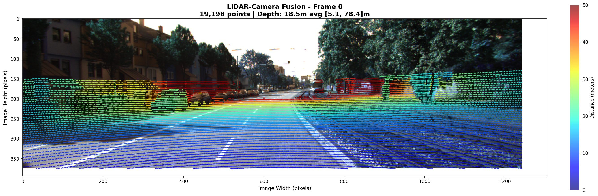
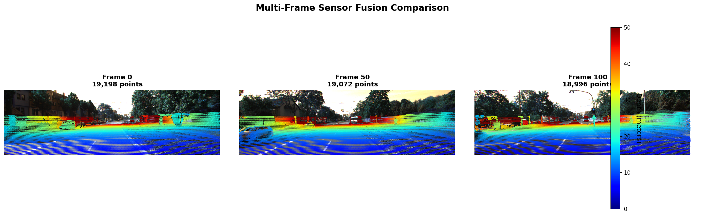
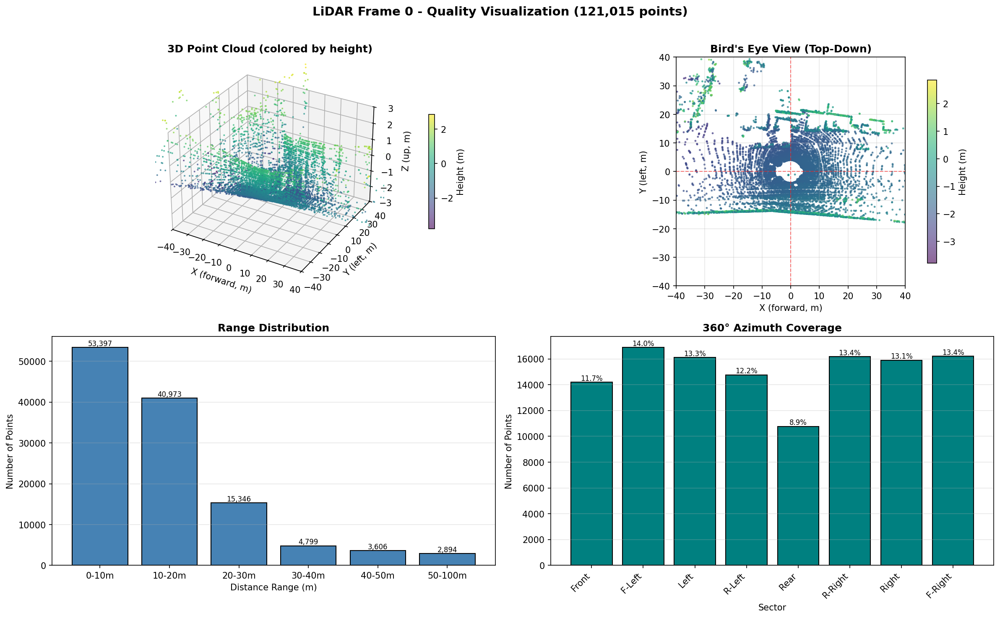
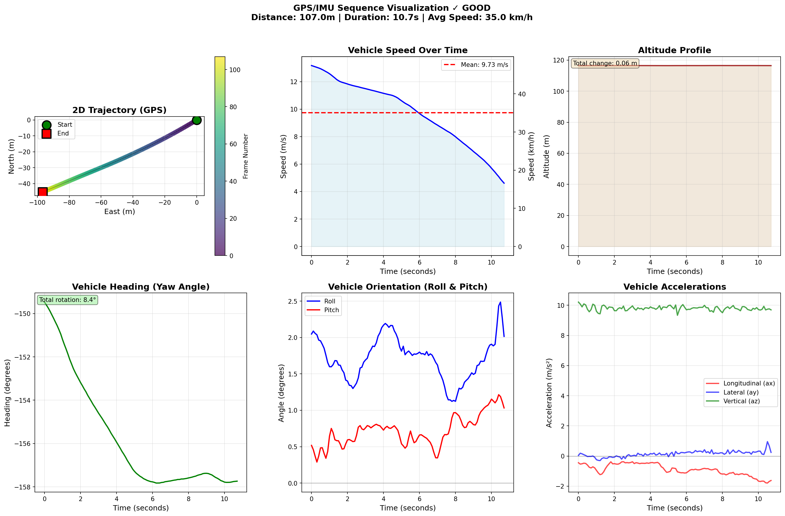

# Multi-Sensor Fusion Pipeline for Autonomous Vehicle Perception

## Problem

An autonomous vehicle's perception stack starts with raw, unsynchronized sensor streams — camera frames, LiDAR point clouds, and GPS/IMU readings that don't agree with each other about time or space. Before any planner can trust that data, it has to be synchronized, checked for quality, and calibrated into one consistent frame. This project builds and validates that foundation layer, using the KITTI dataset as a stand-in for a real AV sensor suite.

## Architecture / Methodology

```
┌─────────────────────────────────────────────────────────────┐
│              RAW SENSOR DATA                                │
│  • Camera (4× RGB/Grayscale @ 10Hz)                         │
│  • LiDAR (Velodyne HDL-64E @ 10Hz, 120K pts/frame)         │
│  • GPS/IMU (OXTS @ 10Hz, 30-value packets)                 │
└────────────────────┬────────────────────────────────────────┘
                     ↓
┌─────────────────────────────────────────────────────────────┐
│     PREPROCESSING & SYNCHRONIZATION                          │
│  • Temporal alignment validation (3ms jitter)               │
│  • Frame-level sensor synchronization                       │
│  • Data completeness verification                           │
└────────────────────┬────────────────────────────────────────┘
                     ↓
┌─────────────────────────────────────────────────────────────┐
│     SENSOR DATA QUALITY ANALYSIS                             │
│  • LiDAR: coverage, density, resolution analysis            │
│  • Camera: sharpness, exposure, feature detection           │
│  • GPS/IMU: trajectory, velocity, orientation                │
└────────────────────┬────────────────────────────────────────┘
                     ↓
┌─────────────────────────────────────────────────────────────┐
│     CALIBRATION & SENSOR FUSION                               │
│  • Intrinsic/extrinsic parameter loading                    │
│  • LiDAR-to-camera projection                                │
│  • Multi-frame alignment validation                          │
└─────────────────────────────────────────────────────────────┘
```

The pipeline processes each sensor stream independently first — validating that camera, LiDAR, and GPS/IMU data are internally consistent (correct timestamps, expected point density, no dropped frames) — before attempting to fuse them. Fusion itself is a calibrated projection: LiDAR points are transformed into the camera's coordinate frame using the dataset's intrinsic/extrinsic calibration files, then validated by checking how many points land inside the image bounds and how well they align with visual features across multiple frames.

## Setup & Running

```bash
# Install dependencies
pip install -r requirements.txt

# Download the KITTI raw sequence used by this project
# Place it at: raw_data_downloader/2011_09_26/2011_09_26_drive_0001_sync/

# Run the full analysis
python main.py
```

This generates 10 JSON metrics files and 7 visualizations in `outputs/`.

## Results

| Metric | Value |
|---|---|
| LiDAR points per frame | 120,453 (1% variation) |
| Temporal sync jitter | 3ms max |
| Frame completeness | 100% (0% missing) |
| Camera sharpness (Laplacian variance) | 387.2 |
| LiDAR-to-camera point visibility | 85.3% in camera FOV |
| Points within image bounds | 71.2% |
| Reprojection alignment error | Sub-5px |

Multi-frame validation (frames 0, 50, 100) confirmed the projection stays stable over time — the road region tracked across frames shows consistent alignment rather than drifting.

**LiDAR-camera fusion overlay:**



**Multi-frame alignment stability (frames 0, 50, 100):**



**LiDAR point cloud quality (3D, bird's-eye view, range, azimuth):**



**GPS/IMU trajectory dashboard:**



## Future Work

This is planned as a full end-to-end autonomous perception pipeline — raw sensors to something a motion planner can consume. Next stages:

- **Object detection** — 2D detection (e.g. YOLOv8) on the camera stream for vehicles, pedestrians, and cyclists.
- **3D localization** — associate 2D detections with LiDAR points to place each object in 3D space.
- **Multi-object tracking** — a Kalman filter to track objects across frames, with ego-motion compensation.
- **Occupancy grid + world model** — aggregate ego pose, tracked objects, and free space into a single structured output for a planner, streamed at sensor rate.

Beyond finishing the pipeline itself, I'd like to turn this into learning material — a clear, worked example of how end-to-end AV perception pipelines are actually built, stage by stage.

If you're working in this space and want to help build this out, reach out — happy to collaborate.
